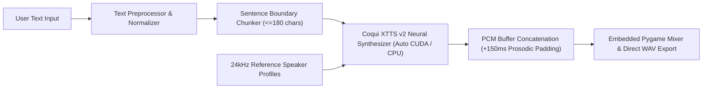

# Voice Studio — Neural Text-to-Speech Desktop Application

[](https://www.python.org/)
[](https://pytorch.org/)
[](https://github.com/coqui-ai/TTS)
[](https://github.com/TomSchimansky/CustomTkinter)
[](LICENSE)

**Voice Studio** is a production-grade desktop application for long-form, multi-speaker neural Text-to-Speech (TTS) synthesis powered by **Coqui XTTS v2** and **PyTorch**. Built with an asynchronous **CustomTkinter** interface, it overcomes standard transformer context-window limitations through intelligent sentence boundary segmentation, phonetic text normalization, and zero-gap PCM audio concatenation.

---

## Key Engineering Features

- **Long-Form Synthesis Pipeline**: Bypasses XTTS token length constraints via a multi-stage sentence and clause boundary splitter (`text_splitter.py`), synthesizing arbitrary-length documents and concatenating `24kHz` PCM buffers with natural prosodic silence padding (`150ms`).
- **Automatic Hardware Detection (`CUDA` ⇄ `CPU` Fallback)**: Dynamically detects available compute hardware (`torch.cuda.is_available()`). Runs accelerated inference on NVIDIA GPUs when present, and seamlessly falls back to standard multi-core `CPU` execution on laptops and desktops without a dedicated GPU.
- **Real-Time Bilingual Localization (English ⇄ Arabic)**: Instant runtime switching between **English (LTR)** and **Arabic (RTL)** across all menus, voice catalogs, and workspace components without restarting the application.
- **Phonetic & Orthographic Pre-Processing**: Includes a dedicated normalization pipeline (`arabic_text_processor.py`) that resolves conflicting diacritics, converts numerals to spoken tokens, and strips kashida/tatweel artifacts prior to neural phonetization.
- **Curated Multi-Speaker Voice Cloning**: Ships with 14 studio-grade reference voice profiles (6 Male, 8 Female) sampled at `24kHz` mono PCM for zero-shot speaker conditioning.
- **Non-Blocking Asynchronous Architecture**: Model initialization, chunk-level inference, and real-time progress callbacks execute on background worker threads while keeping the GUI event loop responsive.
- **PyTorch 2.6+ & SoundFile Compatibility Layer**: Implements safe checkpoint deserialization hooks and direct `soundfile` tensor memory loading (`xtts_engine.py`), eliminating external `TorchCodec` / `FFmpeg` runtime crashes.

---

## System Requirements & Hardware Compatibility

Voice Studio is engineered to run on both **standard laptops/PCs (CPU-only)** and **GPU-accelerated workstations**:

| Component | Minimum Specification (CPU Mode) | Recommended Specification (GPU Mode) |
| :--- | :--- | :--- |
| **Operating System** | Windows 10 / 11 (64-bit), Linux, or macOS | Windows 10 / 11 (64-bit) |
| **Processor (CPU)** | Quad-Core CPU (Intel Core i5 / AMD Ryzen 5 or equivalent) | 6+ Core Modern CPU |
| **Memory (RAM)** | **6 GB – 8 GB RAM** | **16 GB RAM** |
| **Graphics (GPU)** | *No dedicated GPU required* (Automatic `CPU` fallback) | NVIDIA GPU with **4 GB+ VRAM** (`CUDA` supported) |
| **Disk Space** | **3 GB free space** (for automatic first-run XTTS v2 model cache) | **5 GB+ SSD space** |
| **Runtime** | None for standalone `.exe` / `Python 3.10 – 3.12` for source | `Python 3.10 – 3.12` + `CUDA` Runtime |

> **Note on Performance**: On devices without a dedicated NVIDIA GPU, the engine automatically switches to `CPU` inference. Audio quality remains identical (`24kHz` studio WAV), with generation taking a few additional seconds per sentence depending on CPU clock speed.

---

## System Architecture



---

## Project Structure

```text
Voice-Studio-TTS/
├── main.py                      # Application entry point & portable environment bootstrapper
├── xtts_engine.py               # Coqui XTTS v2 inference engine, speaker catalog & tensor hooks
├── text_splitter.py             # Regex-driven sentence & clause boundary segmentation engine
├── arabic_text_processor.py     # Orthographic & phonetic normalization pre-processor
├── audio_player.py              # Thread-safe singleton audio playback controller (Pygame Mixer)
├── create_assets.py             # Programmatic vector/raster asset generator (Pillow)
├── build_exe.py                 # Automated PyInstaller standalone packaging script
├── gui/
│   ├── main_window.py           # Main studio window with real-time EN <-> AR localization
│   ├── chat_bubble.py           # Adaptive LTR/RTL synthesis cards & progress indicators
│   └── audio_widget.py          # Embedded playback transport & WAV file exporter
├── speakers/
│   ├── male/                    # 24kHz studio male reference voice samples (.wav)
│   └── female/                  # 24kHz studio female reference voice samples (.wav)
├── requirements.txt             # Python package dependencies
├── run.bat                      # Quick-launch script for Windows
└── build.bat                    # One-click standalone executable builder
```

---

## Getting Started

### Option A: Running from Source

1. Clone the repository and create a virtual environment:
```bash
git clone https://github.com/Osama-Alzahrani-UQU/Voice-Studio-TTS.git
cd Voice-Studio-TTS
python -m venv venv
```

2. Activate the environment and install dependencies:
```bash
# Windows
venv\Scripts\activate
pip install --upgrade pip
pip install -r requirements.txt
pip install coqui-tts
```
*(On Windows, you can also run `create_venv.bat` to automate environment setup).*

3. Launch the application:
```bash
python main.py
```
*(Or double-click `run.bat` on Windows).*

### Option B: Building a Standalone Executable (`.exe`)

To compile a self-contained Windows executable using **PyInstaller** (no Python installation required on target machines):

```bash
python build_exe.py
```
The compiled distribution will be generated at:
```text
dist/LocalTTS_App/LocalTTS_App.exe
```

---

## License

This project is licensed under the **MIT License** — see the [LICENSE](LICENSE) file for details.
