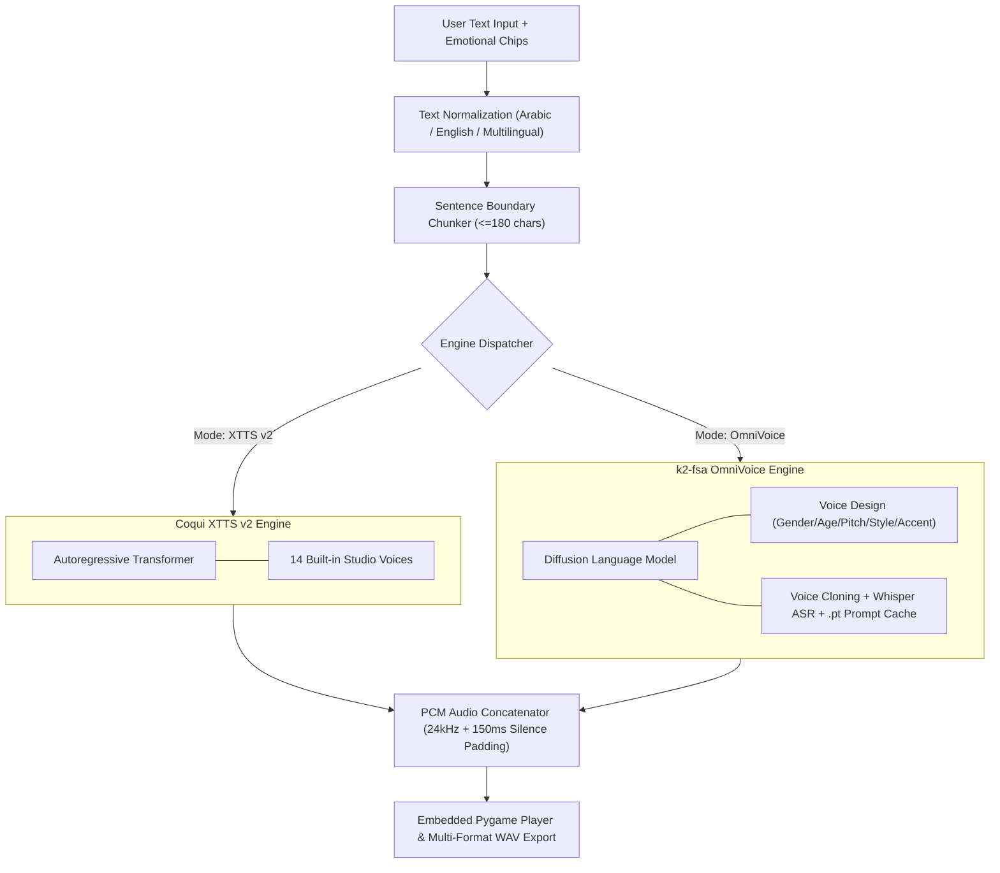

# Voice Studio — Dual-Engine Neural Text-to-Speech Desktop Application

[](https://www.python.org/)
[](https://pytorch.org/)
[](https://github.com/k2-fsa/OmniVoice)
[](https://github.com/coqui-ai/TTS)
[](https://github.com/TomSchimansky/CustomTkinter)
[](LICENSE)

**Voice Studio** is a production-grade desktop application for multi-speaker, massively multilingual neural Text-to-Speech (TTS) synthesis featuring a **Dual-Engine Architecture**:

1. **k2-fsa OmniVoice Diffusion Engine**: Supports over **600+ languages**, ultra-fast diffusion generation (~0.025 RTF, 40x real-time), prompt-based **Voice Design** (Gender, Age, Pitch, Style, Accents) without reference audio, zero-shot **Voice Cloning** with Whisper ASR, and fine-grained emotional tokens (`[laughter]`, `[whisper]`, `[pause]`, `[sigh]`).
2. **Coqui XTTS v2 Engine**: High-fidelity speaker cloning with 14 built-in studio voice profiles, sentence boundary segmentation, and zero-gap PCM concatenation.

Built with an asynchronous **CustomTkinter** desktop interface with instant runtime bilingual localization (English LTR ⇄ Arabic RTL).

---

## Key Engineering Features

- **Dual-Engine Speech Synthesis**: Switch dynamically between Coqui XTTS v2 and k2-fsa OmniVoice directly from the top toolbar without restarting the application.
- **600+ Massively Multilingual Coverage**: Synthesize speech across over 600 languages with automatic language detection, Arabic phonetic normalization, and localized dialect/accent presets.
- **Voice Design Studio (No Reference Audio Required)**: Create custom synthetic voices by defining speaker attributes: Gender, Age (Child, Teenager, Young Adult, Middle-aged, Elderly), Pitch (Very Low to Very High), Style (Normal / Whisper), and English Accents.
- **Instant Voice Cloning & Caching**: Clone any voice from a 3–10s audio sample with automatic Whisper transcription, and save cloned voices as `.pt` prompt files for instant zero-latency recall.
- **Emotional & Non-Verbal Quick Chips**: One-click chips directly above the text box to insert non-verbal acoustic tokens: `😂 [laughter]`, `🤫 [whisper]`, `⏸️ [pause]`, and `💨 [sigh]`.
- **Long-Form Sentence Boundary Chunker**: Splits arbitrary-length texts into prosodic chunks (`<=180 chars`), synthesizes sequentially in background worker threads, and concatenates with `150ms` silence padding into studio `24kHz` WAV files.
- **Hardware Acceleration (`CUDA` ⇄ `CPU` Automatic Fallback)**: Automatically detects NVIDIA GPUs for high-speed CUDA inference and seamlessly falls back to multi-core CPU execution.
- **Bilingual Interface Localization**: Complete English (LTR) ⇄ Arabic (RTL) layout switching with full widget realignment.

---

## Dual-Engine Comparison

| Feature | Coqui XTTS v2 Engine | k2-fsa OmniVoice Engine |
| :--- | :--- | :--- |
| **Architecture** | Autoregressive Transformer + Vocoder | Diffusion Language Model (DLM) |
| **Language Coverage** | 17 languages | **600+ languages** |
| **Inference Speed** | Heavy transformer (~0.5 - 1.0 RTF) | **Ultra-fast (~0.025 RTF, 40x real-time)** |
| **Voice Design** | Requires reference audio | **Attribute-based (Gender, Age, Pitch, Style, Accent)** |
| **Voice Cloning** | Reference WAV required | Reference WAV with optional auto Whisper transcription |
| **Voice Cache** | Re-computed per session | **Save as `.pt` prompt file for instant reuse** |
| **Non-Verbal Tokens** | Limited | **Full support (`[laughter]`, `[whisper]`, etc.)** |
| **Sample Rate** | 24,000 Hz | **24,000 Hz (100% interoperable)** |

---

## System Architecture



---

## Project Structure

```text
Voice-Studio-TTS/
├── main.py                      # Application entry point & environment setup
├── unified_tts_manager.py       # Dual-engine facade (XTTS v2 + OmniVoice)
├── omnivoice_engine.py          # k2-fsa OmniVoice diffusion inference manager
├── xtts_engine.py               # Coqui XTTS v2 inference engine & speaker catalog
├── text_splitter.py             # Sentence & clause boundary segmentation engine
├── arabic_text_processor.py     # Arabic orthographic & phonetic normalizer
├── audio_player.py              # Thread-safe audio player (Pygame Mixer)
├── omnivoice/                   # Embedded OmniVoice core package
├── gui/
│   ├── main_window.py           # Main studio window with dual-engine UI & quick chips
│   ├── chat_bubble.py           # Adaptive audio output cards with engine badges
│   └── audio_widget.py          # Audio playback transport & WAV exporter
├── speakers/
│   ├── male/                    # 24kHz studio male reference voice samples
│   └── female/                  # 24kHz studio female reference voice samples
├── saved_prompts/               # Saved cloned voice prompts (.pt) for instant reuse
├── requirements.txt             # Python package dependencies
├── run.bat                      # Windows launch script
└── build.bat                    # One-click standalone executable builder
```

---

## Installation & Quick Start

### 1. Clone the repository
```bash
git clone https://github.com/Osama-Alzahrani-UQU/Voice-Studio-TTS.git
cd Voice-Studio-TTS
```

### 2. Create and activate a virtual environment
```bash
python -m venv venv

# Windows
venv\Scripts\activate

# Linux / macOS
source venv/bin/activate
```

### 3. Install dependencies
```bash
pip install --upgrade pip
pip install -r requirements.txt
pip install coqui-tts
```

### 4. Launch Voice Studio
```bash
python main.py
```
*(On Windows, you can simply run `run.bat`).*

---

## Open Source Acknowledgments & Attribution

We express our gratitude to the open-source projects and authors whose foundational research makes Voice Studio possible:

- **[OmniVoice](https://github.com/k2-fsa/OmniVoice)**: Created by **Han Zhu** and the **Xiaomi AI Lab / Next-gen Kaldi team** (k2-fsa).
- **[Coqui TTS](https://github.com/coqui-ai/TTS)**: Created by the **Coqui AI team** for the XTTS v2 multilingual autoregressive model.
- **[CustomTkinter](https://github.com/TomSchimansky/CustomTkinter)**: Created by **Tom Schimansky** for the modern UI framework.
- **[Pygame](https://github.com/pygame/pygame)**: For cross-platform real-time audio playback.

---

## License

This project is licensed under the **MIT License** — see the [LICENSE](LICENSE) file for details.

---
---

# استوديو الصوت — تطبيق سطح المكتب لتوليد الصوت بالذكاء الاصطناعي (عربي)

**استوديو الصوت (Voice Studio)** هو تطبيق متكامل لسطح المكتب لتحويل النص إلى كلام بالذكاء الاصطناعي معمارية المحرك المزدوج:

1. **محرك OmniVoice (من k2-fsa)**: يدعم أكثر من **600 لغة**، وسرعة توليد فائقة بتقنية الانتشار (Diffusion) أسرع بـ 40 ضعفاً من الوقت الحقيقي، وميزة **تصميم الأصوات** عبر تحديد الخصائص (الجنس، العمر، الطبقة، الأسلوب، اللهجة) دون الحاجة لملف صوتي سابق، واستنساخ الأصوات مع التفريغ التلقائي عبر Whisper، ودعم الرموز التعبيرية غير اللفظية (`[laughter]` ضحك، `[whisper]` همس، `[pause]` وقفة، `[sigh]` تنهد).
2. **محرك Coqui XTTS v2**: استنساخ عالي الدقة مع 14 صوتاً استوديو مدمجاً ومعالجة النصوص الطويلة دون انقطاع.

---

## أهم المميزات البرمجية

- **التبديل بين المحركين**: التبديل الفوري بين XTTS v2 و OmniVoice من الشريط العلوي بضغطة زر واحدة.
- **أكثر من 600 لغة**: تغطية لغوية شاملة مع معالجة وتطبيع النصوص العربية وتشكيلها تلقائياً.
- **استوديو تصميم الأصوات**: تحديد مواصفات الصوت (ذكر/أنثى، طفل/شاب/مسن، طبقة منخفضة/معتدلة/مرتفعة، أسلوب طبيعي/همس، واللهجات المختلفة).
- **استنساخ وحفظ البصمة الصوتية**: استنساخ أي صوت من مقطع مرجعي (3-10 ثوانٍ) وحفظه كملف موجه `.pt` لإعادة استخدامه فوراً في أي وقت.
- **أزرار التعبيرات السريعة**: أزرار فوق صندوق الكتابة لإدراج الرموز الصوتية مثل `😂 [laughter]` و `🤫 [whisper]`.
- **واجهة ثنائية اللغة بالكامل**: دعم كامل للغتين العربية (RTL) والإنجليزية (LTR) مع تحويل فوري لجميع القوائم والشاشات.
- **تسريع العتاد التلقائي**: الاستفادة من بطاقات NVIDIA عبر CUDA مع التبديل التلقائي إلى المعالج CPU عند عدم توفر كرت شاشة منفصل.

---

## شكر وتقدير للمشاريع مفتوحة المصدر

نتقدم بالشكر والتقدير للمشاريع والباحثين الذين بنيت عليهم هذه التقنيات:
- **فريق k2-fsa و Xiaomi AI Lab والباحث Han Zhu** لمشروع [OmniVoice](https://github.com/k2-fsa/OmniVoice).
- **فريق Coqui AI** لمشروع [Coqui TTS](https://github.com/coqui-ai/TTS).
- **Tom Schimansky** لمشروع [CustomTkinter](https://github.com/TomSchimansky/CustomTkinter).
